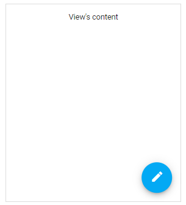

<!-- default badges list -->

<!-- default badges end -->
# DevExtreme Floating Action Button Single Action - Getting Started 

This repository stores the code examples of the Floating Action Button component for the [Getting Started with Floating Action Button - Single Action](https://js.devexpress.com/Documentation/Guide/UI_Components/Floating_Action_Button/Getting_Started_with_Floating_Action_Button/#Single_Action) tutorial. A single-action FAB represents the primary action of a screen.

## Files to Review

- **Angular**
    - [app.component.html](angular/src/app/app.component.html)
    - [app.component.ts](angular/src/app/app.component.ts)
- **jQuery**
    - [index.js](jquery/index.js)
- **React**
    - [App.js](react/src/App.js)
- **Vue**
    - [App.vue](vue/src/App.vue)

## Documentation

- [Getting Started with Floating Action Button - Single Action](https://js.devexpress.com/Documentation/Guide/UI_Components/Floating_Action_Button/Getting_Started_with_Floating_Action_Button/#Single_Action)

- [Floating Action Button - API Reference](https://js.devexpress.com/Documentation/ApiReference/UI_Components/dxSpeedDialAction/)
